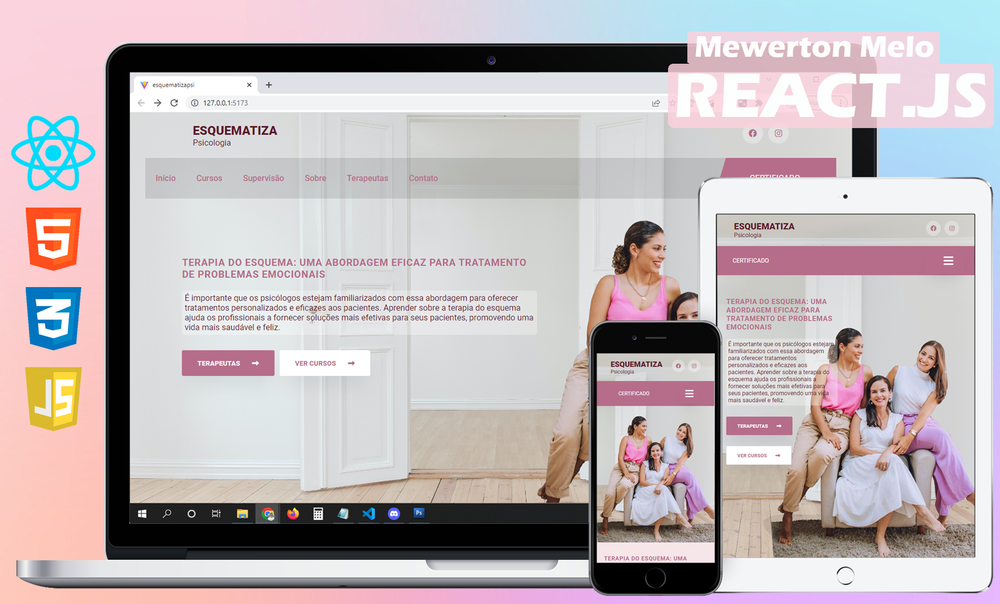

 Plataforma de ensino para Terapeutas do Esquema

 

  <h1 align="center"><a href="#"> Plataforma de ensino - esquematizapsi</a></h1>

<h4 align="center"> 
	 Status: Em desenvolvimento... 
</h4>

  <h4 align="center"><a href="#">https:...</a></h4>

  

## 💻 Sobre:

A aplicação em desenvolvimento é uma plataforma de cursos online para estudantes e profissionais da área de psicologia que buscam conhecimentos sobre a Terapia do Esquema.

Neste projeto estão sendo abordados os seguintes temas:

- [ReactJs](https://reactjs.org)
- [Javascript](https://developer.mozilla.org/pt-BR/docs/Web/JavaScript)
- [Vite](https://vitejs.dev/)
- [Styled Components](https://styled-components.com/)
- [React Router Dom](https://react-icons.github.io/react-icons/)
- [React Icons](https://react-icons.github.io/react-icons)
- [Framer Motion](https://www.npmjs.com/package/framer-motion)
- [Font Awesome](https://cdnjs.com/libraries/font-awesome)

---

## 🛠 Tecnologias

Este projeto será desenvolvido com as seguintes tecnologias:

- HTML
- CSS
- JavaScript
- React.js

---

## Deploy do projeto.
https://...

---

